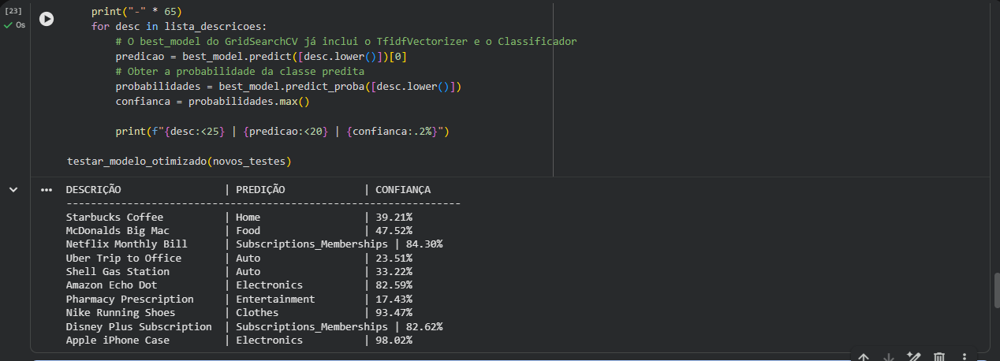
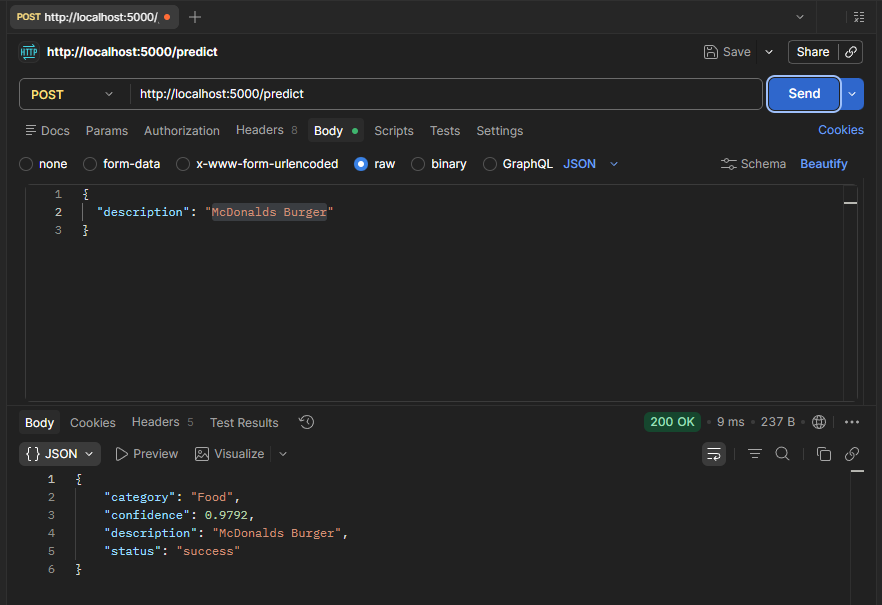
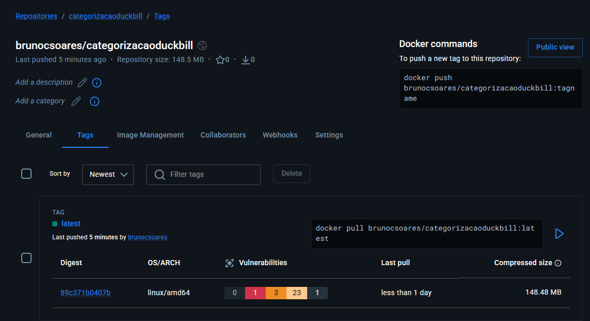

# 🦆 DuckBill AI - Classificação Inteligente de Despesas

O **DuckBill** é um ecossistema de gestão financeira voltado para o público jovem. Este repositório contém o **Motor de IA**, responsável por automatizar a categorização de gastos através de Processamento de Linguagem Natural (NLP).

## 🚀 Sobre a Sprint 3
Nesta etapa, focamos na inteligência preditiva e na portabilidade da solução:
* **IA:** Modelo de Machine Learning (Random Forest + TF-IDF) para classificação de texto.
* **Backend:** API REST desenvolvida em Flask.
* **DevOps:** Containerização da aplicação com Docker e disponibilização no Docker Hub.

---

## 📸 Evidências de Execução

### 1. Treinamento e Acurácia do Modelo
O modelo foi treinado utilizando uma base de dados de transações bancárias, alcançando um alto índice de confiança.


### 2. API em Funcionamento (Teste de Integração)
Demonstração da API recebendo uma descrição de gasto e retornando a categoria e o nível de confiança via JSON.


### 3. Containerização Docker
O serviço está isolado em um container, garantindo que as dependências (scikit-learn, flask) funcionem em qualquer ambiente.


---

## 🛠️ Tecnologias Utilizadas
* **Linguagem:** Python 3.11
* **IA/ML:** Scikit-Learn, Pandas, Joblib
* **Web:** Flask, Gunicorn
* **Infra:** Docker, Docker Compose

---

## 📦 Como rodar o projeto

Você pode rodar a aplicação diretamente do **Docker Hub** sem precisar configurar o ambiente Python localmente:

1. **Baixe e execute o container:**
```bash
docker run -p 5000:5000 brunocsoares/categorizacaoduckbill:latest
```

2. **Teste a API:**
Envie um POST para http://localhost:5000/predict com o corpo:
```bash
{
  "description": "McDonalds Big Mac"
}
```

---

👥 Integrantes
Bruno Carlos Soares - RM 559250

Lucas Borges de Souza - RM 560027

Pedro Henrique da Silva - RM 560393

